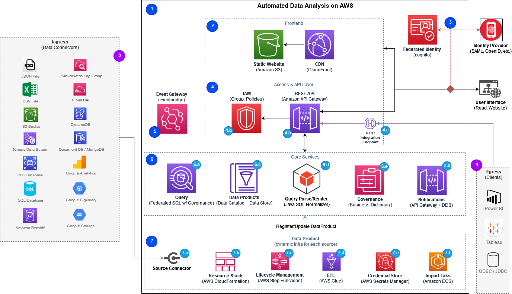

# Automated Data Analytics on AWS

The Automated Data Analytics on AWS solution provides an end-to-end data platform for ingesting, transforming, managing and querying datasets. This helps analysts and business users manage and gain insights from data without deep technical experience using Amazon Web Services (AWS). It has an open-sourced architecture with connectors to commonly used AWS services, along with third-party data sources and services. This solution also provides an user interface (UI) to search, share, manage, and query datasets using standard SQL commands.

## Architecture overview

The following diagram represents the solution's architecture design.



The Automated Data Analytics on AWS solution automates the building of data pipelines that are optimized for the size, frequency of update, and type of data. These data pipelines handle the data ingestion, transformations, and queries.

The Automated Data Analytics on AWS solution creates and integrates a combination of AWS services required to perform these tasks, abstracted through a user interface. These services include AWS Glue crawlers, jobs, workflows and triggers, along with S3 buckets, IAM integration, and other services. Additionally, the solution automatically detects and redacts personally identifiable information (PII) with granular security and governance controls.

For more information on the solution’s architecture, refer to the [implementation guide](https://docs.aws.amazon.com/solutions/latest/automated-data-analytics-on-aws/architecture-overview.html).

---

## Prerequisites

### Build environment specifications

- To build and deploy this solution, we recommend using Ubuntu with minimum 4 cores CPU, 16GB RAM. Mac(Intel) or other Linux distributions are also supported.
- The computer used to build the solution must be able to access the internet.

### AWS Account

- A CDK bootstrapped AWS account.

  - https://docs.aws.amazon.com/cdk/latest/guide/bootstrapping.html

- Sufficient AWS Lambda Concurrent executions limit
  - Please use AWS Service Quotas to verify AWS Lambda Concurrent exeuctions `Applied quota value` in your account is greater or equal to the `AWS default quota value` (which is 1000). Click this [link](https://console.aws.amazon.com/servicequotas/home/services/lambda/quotas/L-B99A9384) to check it in your AWS Console. If `Applied quota value` is less than 1000, please use `Request quota increase` button to make a request to increase it to at least 1000 before deploying the solution. For more details, please refer to [AWS Lambda Developer Guide](https://docs.aws.amazon.com/lambda/latest/dg/gettingstarted-limits.html).

### Tools

- [AWS CLI](https://aws.amazon.com/cli/)
- [Node.js](https://docs.npmjs.com/getting-started) (version 14)
- [Yarn](https://classic.yarnpkg.com/lang/en/docs/install/)
- Python 3.9 (we recommend using `virtualenv` to avoid version conflicts)
- Java Runtime
  - The solution requires a Java 8 Runtime. We strongly recommend using [Amazon Corretto 8](https://docs.aws.amazon.com/corretto/latest/corretto-8-ug/downloads-list.html). Alternatively, you can also use other OpenJDKs such as [Eclipse Temurin](https://adoptium.net/en-GB/temurin/releases/?version=8).
- [Maven](https://maven.apache.org/install.html) (>=3.5.2)
  - We recommend configuring Maven to use an OpenJDK8 compatible JAVA version, such as Amazon Corretto 8.
- [Docker Desktop](https://www.docker.com/get-started/) (>= v20.10)
- Netstat (included in `net-tools` package)
- Libraries for Chrome:
  - libatk-1.0.so.0
  - libcups.so.2
  - libxkbcommon.so.0
  - libXdamage.so.1
  - libpango-1.0.so.0
  - libcairo.so.2
  - libgtk-3.so.0
  - libasound.so.2

> **Note regarding AWS CDK version:** We recommend running all `cdk <cmd>` related tasks via `yarn cdk <cmd>` to ensure exact version parity. If you choose to run globally installed `cdk` command, ensure you have a compatible version of [AWS CDK](https://docs.aws.amazon.com/cdk/latest/guide/home.html) installed globally.

---

## Preparing build environment
### Amazon Linux 2

Install dependencies
```
sudo yum install -y git
```

Install Java Runtime
```
wget https://corretto.aws/downloads/latest/amazon-corretto-8-x64-linux-jdk.rpm
sudo yum localinstall amazon-corretto-8-x64-linux-jdk.rpm
```

Install Maven
```
mkdir ~/maven
cd ~/maven
wget https://dlcdn.apache.org/maven/maven-3/3.8.7/binaries/apache-maven-3.8.7-bin.tar.gz
tar xzvf apache-maven-3.8.7-bin.tar.gz
export PATH="$HOME/maven/apache-maven-3.8.7/bin:$PATH"

echo export PATH="$HOME/maven/apache-maven-3.8.7/bin:$PATH" >> ~/.bashrc
```

Install NVM
```
curl -o- https://raw.githubusercontent.com/nvm-sh/nvm/v0.39.2/install.sh | bash
source ~/.bashrc
```

Install Node.js

```
nvm install 14
```

Install Yarn
```
npm install --global yarn
```

Install Docker
```
sudo yum install -y docker

sudo systemctl start docker
sudo systemctl enable docker

sudo usermod -aG docker ${USER}
newgrp docker
```

Install and configure virtualenv
```
pip3 install --user pipenv
export PATH="$HOME/.local/bin:$PATH"
git clone https://github.com/pyenv/pyenv.git ~/.pyenv
export PATH="$HOME/.pyenv/bin:$PATH"

echo export PATH="$HOME/.local/bin:$PATH" >> ~/.bashrc
echo export PATH="$HOME/.pyenv/bin:$PATH" >> ~/.bashrc

sudo yum-builddep -y python3
pipenv --python 3.9
```

---

### Ubuntu 22.04

Download package information and install dependencies
```
sudo apt update
sudo apt -y install unzip ca-certificates curl gnupg lsb-release python3-pip python3-venv net-tools \
    libatk-bridge2.0-0 libcups2 libxkbcommon-x11-0 libxdamage1 libgbm-dev libpango-1.0-0 libcairo2 libgtk-3-0 libasound2
```

Install AWS CLI
```
curl "https://awscli.amazonaws.com/awscli-exe-linux-x86_64.zip" -o "awscliv2.zip"
unzip awscliv2.zip
sudo ./aws/install
```

Install Java Runtime
```
wget https://corretto.aws/downloads/latest/amazon-corretto-8-x64-linux-jdk.deb
sudo apt install ./amazon-corretto-8-x64-linux-jdk.deb
```

Install Maven
```
mkdir ~/maven
cd ~/maven
wget https://dlcdn.apache.org/maven/maven-3/3.8.7/binaries/apache-maven-3.8.7-bin.tar.gz
tar xzvf apache-maven-3.8.7-bin.tar.gz
export PATH="$HOME/maven/apache-maven-3.8.7/bin:$PATH"

echo export PATH="$HOME/maven/apache-maven-3.8.7/bin:$PATH" >> ~/.bashrc
```

Install NVM
```
curl -o- https://raw.githubusercontent.com/nvm-sh/nvm/v0.39.2/install.sh | bash
source ~/.bashrc
```

Install Node.js

```
nvm install 14
```

Install Yarn
```
npm install --global yarn
```

Install Docker
```
sudo mkdir -p /etc/apt/keyrings
curl -fsSL https://download.docker.com/linux/ubuntu/gpg | sudo gpg --dearmor -o /etc/apt/keyrings/docker.gpg

echo \
  "deb [arch=$(dpkg --print-architecture) signed-by=/etc/apt/keyrings/docker.gpg] https://download.docker.com/linux/ubuntu \
  $(lsb_release -cs) stable" | sudo tee /etc/apt/sources.list.d/docker.list > /dev/null

sudo apt update

sudo apt -y install docker-ce docker-ce-cli containerd.io docker-compose-plugin

sudo usermod -aG docker ${USER}
newgrp docker
```

Install and configure virtualenv
```
pip3 install --user pipenv
export PATH="$HOME/.local/bin:$PATH"
git clone https://github.com/pyenv/pyenv.git ~/.pyenv
export PATH="$HOME/.pyenv/bin:$PATH"

echo export PATH="$HOME/.local/bin:$PATH" >> ~/.bashrc
echo export PATH="$HOME/.pyenv/bin:$PATH" >> ~/.bashrc
```

Uncomment `dep-src` to use `build-dep`

```
sudo sed -i 's/# deb-src/deb-src/g' /etc/apt/sources.list
sudo apt update
sudo apt build-dep python3
```

Install dependency and necessary version of Python
```
sudo apt install -y make build-essential libssl-dev zlib1g-dev \
    libbz2-dev libreadline-dev libsqlite3-dev wget curl llvm \
    libncursesw5-dev xz-utils tk-dev libxml2-dev libxmlsec1-dev libffi-dev liblzma-dev

pipenv --python 3.9
```

---

## Build and run the unit tests

1. Clone the solution source code from its GitHub repository:

   ```
   git clone https://github.com/aws-solutions/automated-data-analytics-on-aws
   ```
2. Open the terminal and navigate to the source folder created in step 1:
   ```
   cd automated-data-analytics-on-aws/source
   ```
3. Activate `virtaulenv`:

   ```
   pyenv local 3.9
   eval "$(pyenv init -)"
   ```
4. Run the following command:

   ```
   chmod +x ./run-all-tests.sh
   ./run-all-tests.sh
   ```

The `/source/run-all-tests.sh` script is the centralized script to install all dependencies, build the solution from source code and execute all unit tests.

**The build process including downloading dependencies takes about 60 minutes the first time.**

---

## File structure

After you have successfully cloned the repository into your local development environment, you will see the following file structure in your editor.

```
|- .github/ ...                       - resources for open-source contributions.
|- source/                            - solution's source code
  |- @types                           - type utilities
  |- cypress                          - cypress tests
  |- images                           - images files for the documentation
  |- packages                         - multiple packages of solution source code, including unit tests
  |- scripts                          - helper scripts
  |- header.txt                       - license header
  |- lerna.json                       - configuration file for lerna
  |- packages.json                    - package file for solution root package
  |- run-all-tests.sh                 - runs all tests within the /source folder
  |- yarn-audit.js                    - helper script for yarn audit
  |- yarn.lock                        - yarn lockfile
|- .gitignore
|- CHANGELOG.md                       - changelog file to track changes between versions
|- CODE_OF_CONDUCT.md                 - code of conduct for open source contribution
|- CONTRIBUTING.md                    - detailed information about open source contribution
|- LICENSE.txt                        - Apache 2.0 license.
|- NOTICE.txt                         - Copyrights for Automated Data Analytics on AWS solution
|- THIRDPARTY_LICENSE.txt             - Copyrights licenses for third party software that was used in this solution
|- README.md                          - this file
```

---

## Deploying the solution

Before you begin, ensure that:

- The solution has been built and all unit tests have passed as described in the [Build and run unit tests](#build-and-run-the-unit-tests) section.
- You have configured the computer used to deploy the solution with the correct AWS credentials to access the AWS account that Automated Data Analytics on AWS solution will be deployed to.

1. Set the deployment region `export AWS_REGION=<region-id>`. For a list of supported AWS region, refer to https://docs.aws.amazon.com/solutions/latest/automated-data-analytics-on-aws/design-considerations.html
2. Make sure the current directory is in `automated-data-analytics-on-aws/source`
3. Deploy the Automated Data Analytics on AWS solution:
   - To deploy the Automated Data Analytics on AWS solution with its default security settings, use the command below:
     `yarn deploy-solution --parameters adminEmail="<Your email address>" --parameters adminPhoneNumber="<Your mobile number for MFA>"`
   - If the deployment is for evaluation purposes and does not contain any sensitive data, the default Multi-factor Authentication(MFA) feature can be set to `optional` to simplify the process. If this is preferred, use the following command for deployment:
     `yarn deploy-solution --parameters adminEmail="<Your email address>" --parameters adminMFA='OPTIONAL' --parameters advancedSecurityMode='OFF'`

The deployment may take up to 60 minutes to complete. During deployment the temporary password for the root administrator will be sent via email to the specified _adminEmail_. The email address and temporary password received in email can be used to log into the Automated Data Analytics on AWS solution for the initial setup.

After the solution has been deployed, the CDK returns the following information. Using this information, follow the steps to access the Automated Data Analytics on AWS solution.

> **Note**: To view the information returned by CDK from the AWS CloudFormation Console, navigate to the **Ada** stack and select the **Outputs** section.

```
Outputs:
Ada.AthenaProxyApiUrl = example.cloudfront.net:443
Ada.BaseApiUrl = https://example.execute-api.ap-southeast-2.amazonaws.com/prod/
Ada.CognitoUserPoolId = ap-southeast-2_Example
Ada.ExportNamespaceGlobalUUID = example
Ada.RetainedResourcesExport = ["arn:aws:kms:ap-southeast-2:123456789012:key/5dad9516-0007-4993-a613-example","arn:aws:kms:ap-southeast-2:123456789012:key/21d45985-6c92-41e9-a762-example","arn:aws:s3:::ada-dataproductservicestack752cb9-databucket-hash","arn:aws:s3:::ada-dataproductservicestack752-scriptsbucket-hash","arn:aws:s3:::ada-dataproductservicestack-fileuploadbucket-hash"]
Ada.UserPoolClientId = example
Ada.WebsiteUrl = https://example1234.cloudfront.net/
```

- `AthenaProxyApiUrl`: The URL for connecting Automated Data Analytics on AWS with Tableau / PowerBI via JDBC/ODBC.
- `BasedApiUrl`: Rest API URL.
- `CognitoUserPoolId`: Cognito User Pool id.
- `ExportNamespaceGlobalUUID`: A global unique identifier specific to this deployment.
- `RetainedResourcesExport`: A list of AWS Resources ARNs for which the resources will be retained if this solution is uninstalled (tore down) from the web console with retaining data or tore down from AWS CloudFormation Console.
- `UserPoolClientId`: Cognito user pool app client id
- `WebsiteUrl`: Automated Data Analytics on AWS web UI URL

## Accessing the solution web UI

1. Open `WebsiteUrl` in your browser. We recommend using Chrome. You will be redirected to the sign in page that requires username and password.
2. Sign in with the email address specified during deployment as username and use the temporary password received via email after deployment. Note that the sender of the temporary password email is `no-reply@verificationemail.com`.
3. During the sign in, you are required to set a new password when signing in for the first time. If the solution is deployed with MFA enabled, the MFA code is sent to the mobile number specified as _AdminPhone_ as a text message and you will need the MFA code for signing in.
4. After signing in, you can view the Automated Data Analytics on AWS web UI. The current user is the _root administrator_ user who has the highest level of permission for Automated Data Analytics on AWS. We recommend you keep these credentials secure.

We recommend using an external OpenID Connect or SAML 2.0 compatible identity provider to manage your users who need access to Automated Data Analytics on AWS. If there is an existing enterprise Identity Provider, you can integrate it with Automated Data Analytics on AWS. The root administrator user can set it up by accessing `Admin -> Identity Provider` in the Automated Data Analytics on AWS Web UI.

For more information on how to set up your Identity Provider, refer to the [implementation guide](https://docs.aws.amazon.com/solutions/latest/automated-data-analytics-on-aws/using-the-automated-data-analytics-on-aws-solution.html#identity-providers)

---

## Uninstalling the solution

You can uninstall the solution either from the Automated Data Analytics on AWS web UI or by directly deleting the stacks from the AWS CloudFormation console.

To uninstall the solution from the Automated Data Analytics on AWS web UI:

1. Open Automated Data Analytics on AWS web UI and login with the root administrator user details.
2. On the left navigation panel, click `Admin -> TearDown`
   > **Note**: Using the Teardown page, you can permanently remove the Automated Data Analytics on AWS solution from your account. The Teardown option is only available for users with <i>root_admin</i> access.
3. From the Teardown page, choose one of these following actions:
   - **Delete solution** – This will uninstall all the resources associated with the solution but retain the imported data.
   - **Delete solution and data** – This will uninstall all the resources associated with the solution and destroy the imported data.
4. Follow the link displayed on the web UI to AWS CloudFormation Console to monitor all Automated Data Analytics on AWS stacks to be deleted.

**Note**: If you chose to retain data, the data buckets and KMS keys for the data buckets will be retained.

To uninstall the solution from AWS CloudFormation console:

1. Go to the AWS CloudFormation console, and on the **Stacks** page, filter by stack name _ada-dp-_ to get list of dynamic infrastructure created for each Data Product.
2. Navigate to your `Ada` stack, and check its Output section, note down the value of the key `RetainedResourcesExport` and copy it to a text file to keep. These resources are retained after the main Automated Data Analytics on AWS stack is deleted.
3. In AWS CloudFormation console page, select the **Ada** stack and select **Delete**. Wait until all Automated Data Analytics on AWS nested stacks and main stack are deleted completely.
4. The data buckets and the KMS keys to encrypted data in them are retained (as listed out in `RetainedResourcesExport`). You can migrate data out of these buckets.
5. After the migration is completed, navigate to the AWS S3 console, choose each bucket, empty it and delete it for all the buckets that were listed in the `RetainedResourcesExport` file.
6. After deleting the buckets, navigate to AWS KMS Console and delete the two KMS keys that were listed in the `RetainedResourcesExport` file.

---

## Collection of operational metrics

This solution collects anonymous operational metrics to help AWS improve the quality of features of the solution. For more information, including how to disable this capability, refer to the [implementation guide](https://docs.aws.amazon.com/solutions/latest/automated-data-analytics-on-aws/collection-of-operational-metrics.html).

---

Copyright Amazon.com, Inc. or its affiliates. All Rights Reserved.

Licensed under the Apache License Version 2.0 (the "License"). You may not use this file except in compliance with the License. A copy of the License is located at

    http://www.apache.org/licenses/

or in the "license" file accompanying this file. This file is distributed on an "AS IS" BASIS, WITHOUT WARRANTIES OR CONDITIONS OF ANY KIND, express or implied. See the License for the specific language governing permissions and limitations under the License.
